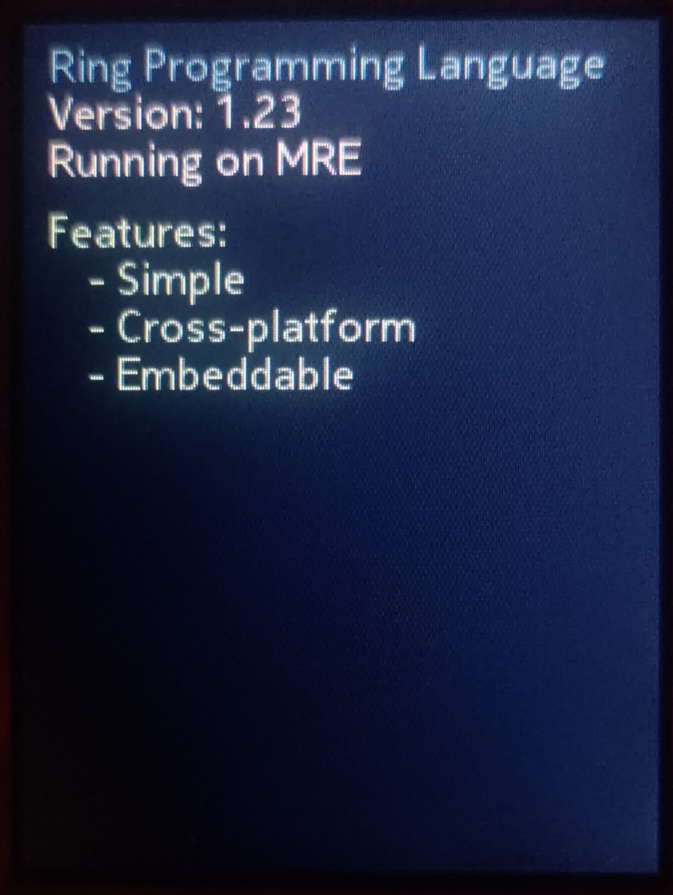
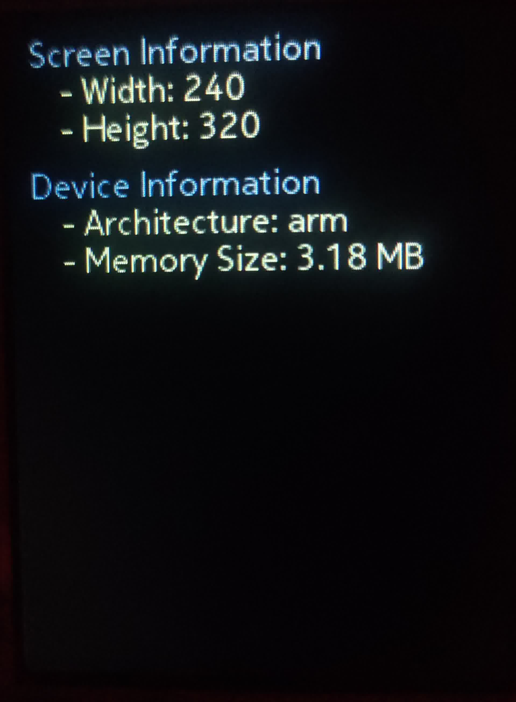
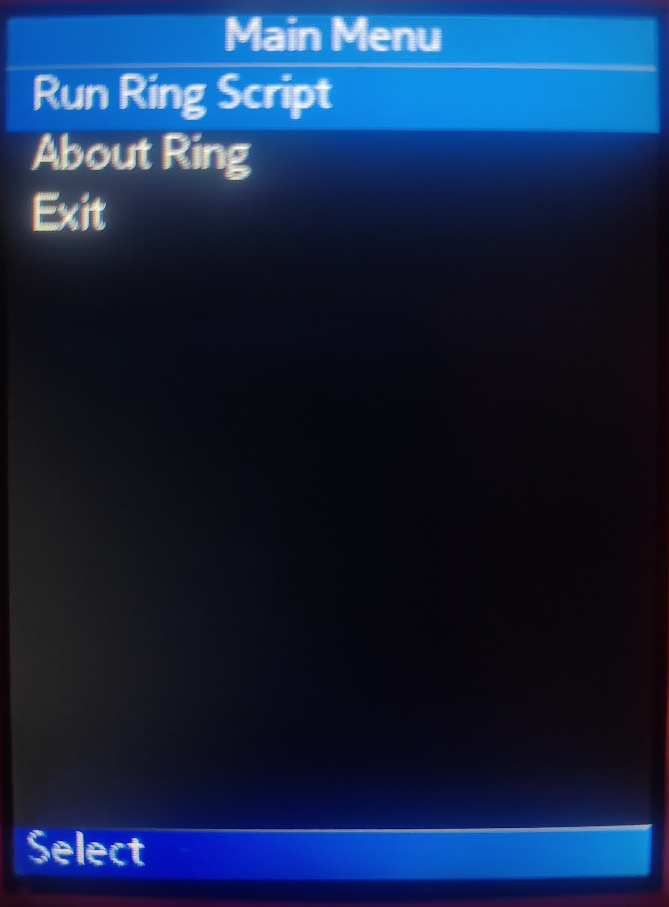

# Ring for MRE

This is an experimental project that enables running applications written in the Ring programming language on MRE devices.

## Screenshots

<p align="center">
    
    
    
</p>

## Build Setup

### System Requirements
- GNU Make
- ARM GCC toolchain (arm-none-eabi-gcc)
- Python

### Installation by OS

<details>
<summary>Linux</summary>

**Void Linux:**
```bash
xbps-install -Sy cross-arm-none-eabi
```

**Ubuntu/Debian:**
```bash
apt-get install build-essential gcc-arm-none-eabi
```

**Arch Linux:**
```bash
pacman -Sy arm-none-eabi-gcc
```
</details>

<details>
<summary>BSD</summary>

**FreeBSD:**
```bash
pkg install -y arm-none-eabi-gcc
```
</details>

<details>
<summary>Windows</summary>

1. Install GNU Make via [MinGW](http://mingw.org/)
2. Install [ARM GNU Toolchain](https://developer.arm.com/downloads/-/gnu-rm)
3. Add both to PATH
</details>

### Building
Run `make` to generate `ring.vxp` in the project directory.

## Installation Guide
1. Get the VXP file:
   - Download from [Releases](https://github.com/ysdragon/ring.vxp/releases) or
   - Build it yourself using steps above

2. **Series 30+ Only:** Sign VXP with your SIM's IMSI
   - Find your IMSI ([guide](https://github.com/raspiduino/mre-sdk/discussions/1#discussioncomment-3571276))
   - Use [this tool](https://vxpatch.luxferre.top/) to sign

3. Setup Ring files:
   - Create `ring` folder in SD card root (usually `e:\ring`)
   - Place Ring source files there
   - Look at [example scripts](examples/) to test

4. Install:
   - Transfer VXP to phone
   - Open using file manager

## Ring MRE Extension Documentation

Before writing scripts, check the [Ring MRE Extension Documentation](docs/ExtensionDocumentation.md) to learn about available functions.

## Tested Devices
- Nokia 225 ✅

## License
Different components are under different licenses:
- `src/`, `Makefile`, and `sdk/build.py`: MIT License
- Ring Language: MIT License
- MRE SDK components (headers, libraries): Proprietary MediaTek License